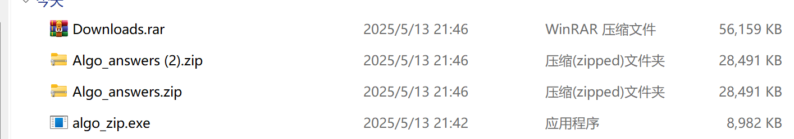

# 算法导论答案 下载器与合并器

因为我不想一个一个点下载所以写了一个脚本并把所有PDF合成一个PDF，然后发现比压缩包还小很多

此 Python 脚本从罗格斯大学数学系网站托管的 CLRS (《算法导论》) 资源下载各个章节的 PDF 文件，然后将它们合并成一个单一的 PDF 文件。

## 原始下载来源

各个 PDF 章节从以下基础 URL 下载：
`https://sites.math.rutgers.edu/~ajl213/CLRS/`

脚本会遍历章节编号 (例如 `Ch1.pdf`, `Ch2.pdf`, ..., `Ch35.pdf`)。

## 脚本功能

1.  **下载 PDF**：尝试从指定的 `base_url` 下载每个章节的 PDF。
2.  **存储 PDF**：下载的 PDF 文件保存在名为 `Algo_answers` 的目录中。
3.  **合并 PDF**：在尝试所有下载后，它会将所有成功下载的 PDF 合并到 `Algo_answers` 目录下一个名为 `Ans_Merged.pdf` 的文件中。

发明了在特定条件下压缩率高于WinRAR的方法（bushi
